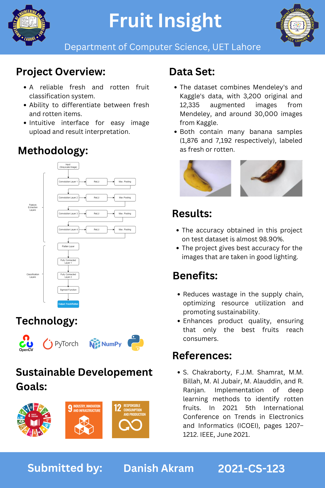
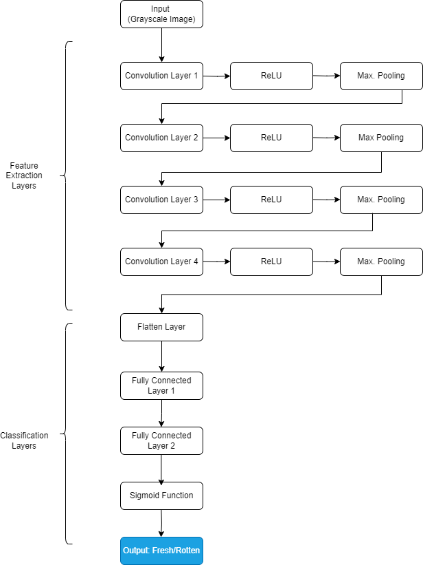
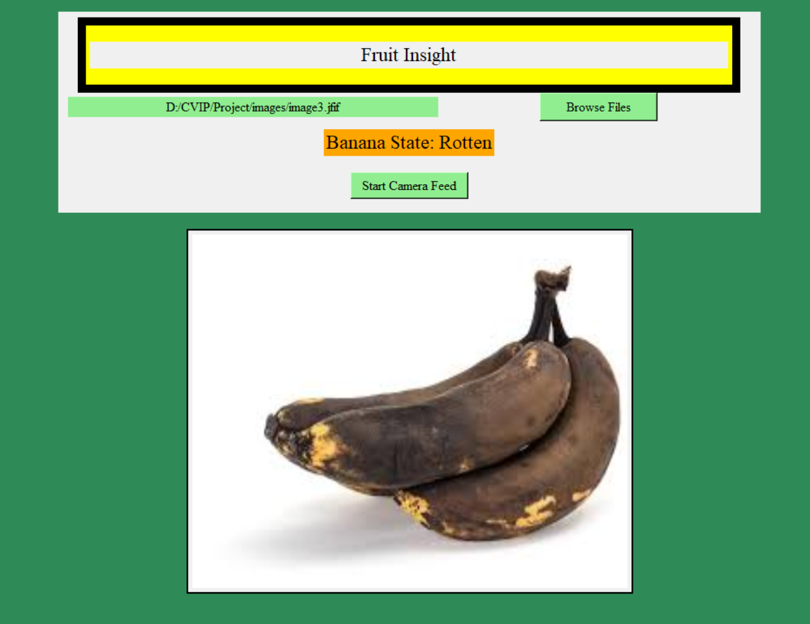

# Fruit Insight

**Fruit Insight** is a computer vision project developed as part of a Computer Vision and Image Processing course. The project focuses on classifying banana images using a custom Convolutional Neural Network (CNN). This initial version of the project utilized approximately 9000 images of bananas collected from two different sources to train the model.

## Project Overview

- **Title**: Fruit Insight
- **Version**: 1.0
- **Course**: Computer Vision and Image Processing
- **Technology Used**: Python, NumPy, PyQt5, OpenCV
- **Accuracy**: 98.90%

## Datasets

The following datasets were used to train the model:

1. [Mendeley Dataset](https://data.mendeley.com/datasets/bdd69gyhv8/1) - A comprehensive dataset with a variety of images from Bangladesh.
2. [Kaggle Dataset](https://www.kaggle.com/datasets/swoyam2609/fresh-and-stale-classification) - Fresh and stale classification dataset.

## Model

- **Type**: Convolutional Neural Network (CNN)
- **Performance**: Achieved an accuracy of 98.90%

## Screenshots

### Project Poster

### Model Architecture

### Project Demo
